<div align="center">
  
</div>

---

# ⚙️ Box Forming Motion Control - Studio 5000 · Siemens NX · MATLAB · OPC DA

<div align="center">


**Proyecto industrial de control de movimiento para una máquina multieje de formado de cajas, con programación en Ladder, validación en Studio 5000 y sincronización con un gemelo digital en Siemens NX.**

[🧾 Autores](#-autores) • [🏗️ Arquitectura](#️-arquitectura-del-sistema) • [📐 MATLAB](#-parametrización-y-optimización-en-matlab) • [🪜 Ladder](#-lógica-de-control-y-secuencia-ladder) • [🧩 Gemelo digital](#-integración-con-siemens-nx-y-opc-da) • [📁 Estructura](#-estructura-del-repositorio)

</div>

---

## 📖 Resumen Ejecutivo

Este repositorio reorganiza el material del **Proyecto Industrial de Servomecanismos 2025-2S** desarrollado en la **Universidad Nacional de Colombia**. El objetivo del proyecto fue **parametrizar, programar y validar** una rutina de control de movimiento industrial para una máquina de **tres grados de libertad (X, Y, Z)** y una banda transportadora, utilizando:

- **Studio 5000 Logix Designer / Logix Emulate**
- **programación en lenguaje Ladder**
- **MATLAB** para cálculo, visualización y optimización de perfiles trapezoidales
- **Siemens NX** como gemelo digital
- **OPC DA** para intercambio de señales entre el PLC y el entorno virtual

La solución implementa una secuencia de trabajo basada en **Grafcet + subrutinas Ladder**, con validación por tendencias y simulación virtual. El informe reporta una producción objetivo de **8 cajas/min**, con un ciclo práctico de aproximadamente **8 s por caja** al considerar la sincronización extra con NX.

### Características principales

- ✅ Parametrización temporal y geométrica del ciclo de formado y retorno
- ✅ Diseño de perfiles trapezoidales para **Y, RotX y RotZ**
- ✅ Optimización automática de aceleraciones y tiempos de reposo
- ✅ Lógica modular en Ladder con **Main + Setup + Forming + Homing + Reset**
- ✅ Exportaciones gráficas del **Grafcet** y de cada subrutina
- ✅ Integración **Studio 5000 <-> OPC DA <-> Siemens NX**
- ✅ Conservación del gemelo digital y de los archivos fuente del proyecto

---

## 🖼️ Recursos del Proyecto

<div align="center">

| Recurso | Descripción | Vista |
|:------:|:------------|:-----:|
| **Panorama de automatización** | Relación entre PLC, Studio 5000, OPC, NX y el proceso | 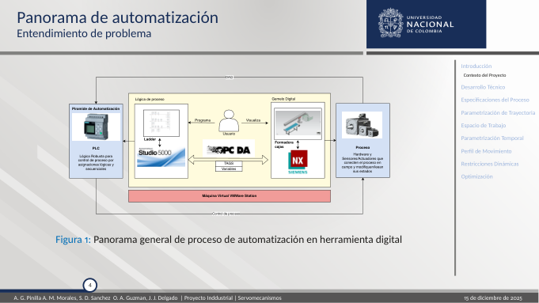 |
| **Perfiles MATLAB** | Posición, velocidad y aceleración del ciclo completo | 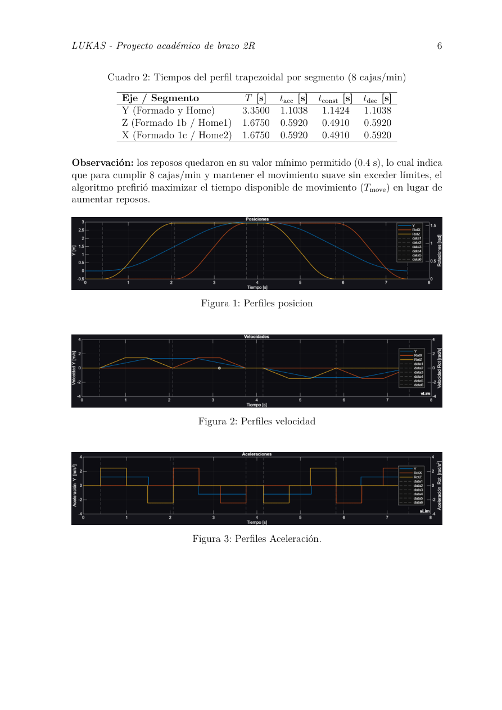 |
| **Grafcet general** | Secuencia principal de operación del sistema | 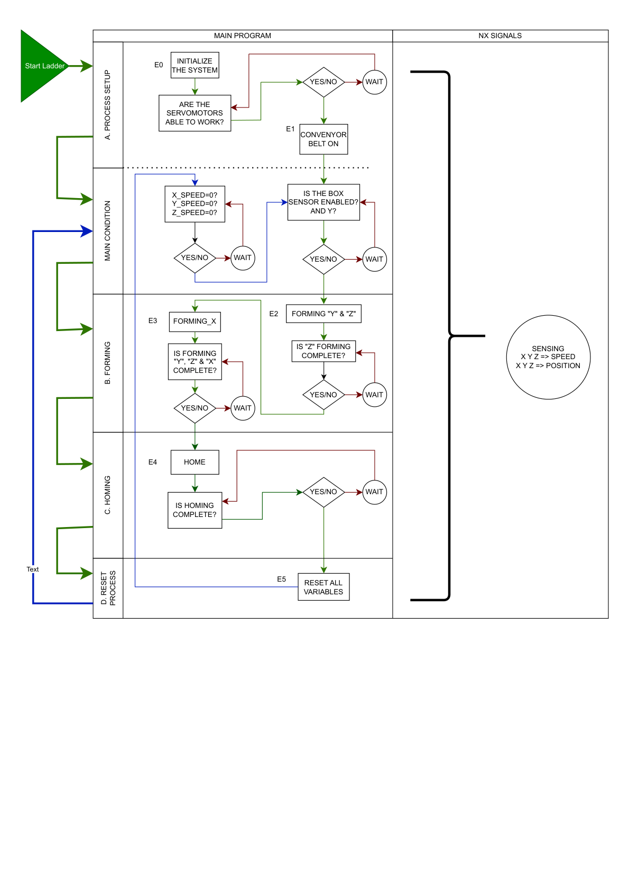 |

</div>

---

## 🧾 Autores

<div align="center">

| Autor | Rol / aporte registrado |
|:------|:------------------------|
| **Samuel David Sanchez Cardenas** | **Líder del proyecto**, encargado destacado de **lógica Ladder** y de la **integración / gemelo digital en Siemens NX**, además de apoyo en perfiles y validación |
| **Juan José Delgado Estrada** | Integrante del proyecto · documentación, validación y diseño de perfiles |
| **Andrés Mauricio Morales Martínez** | Integrante del proyecto |
| **Óscar Andrés Guzmán Vásquez** | Integrante del proyecto |
| **Andrés Gustavo Pinilla Martínez** | Integrante del proyecto |

</div>

### Docente orientador

**Victor Hugo Grisales Palacio**  
Facultad de Ingeniería - Universidad Nacional de Colombia  
Contacto: **vhgrisalesp@unal.edu.co**

---

## 📋 Tabla de Contenidos

1. [Introducción](#-introducción)
2. [Arquitectura del sistema](#️-arquitectura-del-sistema)
3. [Parametrización y optimización en MATLAB](#-parametrización-y-optimización-en-matlab)
4. [Lógica de control y secuencia Ladder](#-lógica-de-control-y-secuencia-ladder)
5. [Integración con Siemens NX y OPC DA](#-integración-con-siemens-nx-y-opc-da)
6. [Validación y resultados](#-validación-y-resultados)
7. [Estructura del repositorio](#-estructura-del-repositorio)
8. [Archivos clave](#-archivos-clave)
9. [Video del gemelo digital](#-video-del-gemelo-digital)
10. [Licencia](#-licencia)

---

## 📖 Introducción

La aplicación estudiada corresponde a una máquina de manipulación de cajas con una banda transportadora y un sistema multieje que realiza la secuencia de **formado, retorno a home y reset**. El proyecto se desarrolló en el marco de la asignatura **Servomecanismos**, con enfoque **PBL (aprendizaje basado en problemas orientado por proyectos)**.

El flujo técnico del trabajo fue:

1. definir geometría, tiempos y restricciones del ciclo;
2. calcular perfiles trapezoidales factibles;
3. optimizar aceleraciones y reposos para cumplir la producción objetivo;
4. traducir la secuencia a **Grafcet + Ladder**;
5. integrar señales del PLC con el gemelo digital en **Siemens NX**;
6. validar con tendencias en Studio 5000 y simulación virtual.

---

## 🏗️ Arquitectura del Sistema

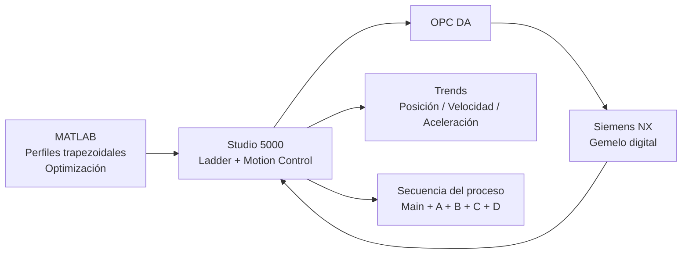

### Secuencia de alto nivel

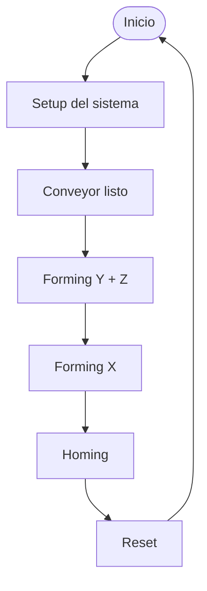

### Estados / etapas observadas

- **Setup**: inicialización de drivers, home de ejes y habilitación del conveyor.
- **Forming**: movimiento coordinado para dar forma a la caja.
- **Homing**: retorno seguro a la posición inicial evitando colisiones.
- **Reset**: limpieza de bits, confirmaciones e instancias de movimiento para reiniciar el ciclo.

---

## 📐 Parametrización y Optimización en MATLAB

El proyecto incluye tres piezas principales de trabajo en MATLAB:

### 1) `Profile_Design.mlx`
Live Script orientado al **diseño base de perfiles trapezoidales** por etapas. Modela el ciclo como:

- **Y**: avance y retorno lineal
- **RotZ**: giro en la primera mitad del formado y retorno al inicio
- **RotX**: giro en la segunda mitad del formado y retorno al inicio

El script:

- define la geometría del sistema (`L1 = 1.5 m`, `L2 = 1.5 m`, giros de `90°`);
- calcula perfiles trapezoidales simétricos;
- concatena etapas del ciclo completo;
- entrega valores útiles para bloques tipo **MAM**;
- grafica **posición, velocidad, aceleración y trayectoria conjunta**.

### 2) `OptimizacionValoresAceleracionYREPOSO.mlx`
Live Script centrado en una **optimización por búsqueda exhaustiva en malla (grid search) con refinamiento**. Busca la mejor combinación de:

- `tR_ini`
- `tR_mid`
- `aY`
- `aX = aZ`

bajo restricciones de:

- `max |a| <= 4`
- `max |v| <= 4`
- factibilidad trapezoidal simétrica `a >= 4L/T^2`

El criterio usado prioriza:

- suavidad del movimiento (**RMS**),
- penalización de picos de aceleración y velocidad,
- una preferencia ligera por aumentar reposos, siempre que el ciclo siga siendo factible.

### 3) `perfil_trapezoidal_sliders.m`
Versión interactiva con **sliders y campos numéricos** para explorar en tiempo real:

- aceleraciones `aY`, `aX`, `aZ`,
- reposo inicial y reposo intermedio,
- cumplimiento de límites,
- métricas RMS y máximas del ciclo.

Es especialmente útil para entender sensibilidad del diseño antes de llevar parámetros a Studio 5000.

### Resultados principales reportados

| Parámetro | Valor |
|:----------|:------|
| Producción objetivo | **8 cajas/min** |
| Tiempo total por caja | **7.5 s** |
| Reposo inicial | **0.4 s** |
| Reposo en mitad | **0.4 s** |
| Tiempo disponible de movimiento | **6.7 s** |
| Aceleración eje Y | **1.210 m/s²** |
| Aceleración rotaciones (`aX = aZ`) | **2.450 rad/s²** |
| RMS eje Y | **0.982 m/s²** |
| RMS ejes X/Z | **1.457 rad/s²** |
| Velocidad máxima eje Y | **1.336 m/s** |
| Velocidad máxima ejes X/Z | **1.450 rad/s** |

### Qué aportan estos scripts al proyecto

- convierten los requerimientos de producción en parámetros concretos de motion control;
- permiten justificar cuantitativamente los valores usados en los bloques de movimiento;
- facilitan comparar teoría vs. tendencias reales del PLC;
- reducen ensayo y error en la sintonía de la secuencia.

<div align="center">
  
  <p><em>Perfiles de posición, velocidad y aceleración obtenidos a partir del diseño de trayectorias.</em></p>
</div>

<div align="center">
  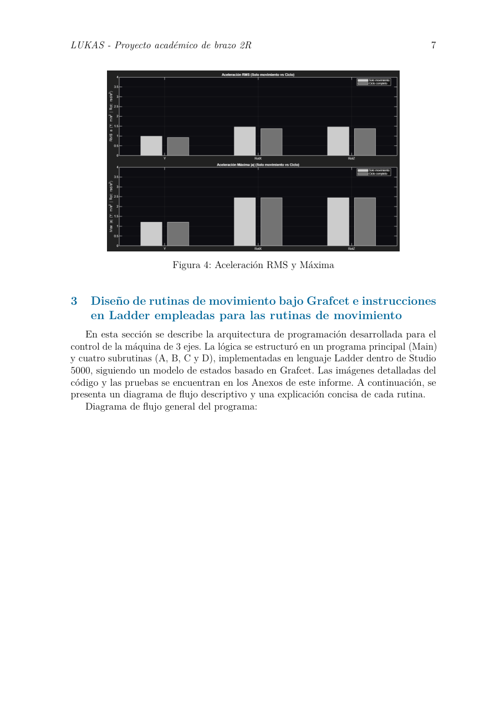
  <p><em>Comparación de aceleración RMS y máxima usada para evaluar suavidad del ciclo.</em></p>
</div>

---

## 🪜 Lógica de Control y Secuencia Ladder

La lógica del PLC se estructuró en un **programa principal** y cuatro subrutinas:

- `Main`
- `A_Process_Setup`
- `B_Process_Formado`
- `C_Process_Home`
- `D_Process_Reset`

### Programa Main
Actúa como coordinador del proceso:

- habilita y deshabilita subrutinas con bits de estado;
- recibe confirmaciones (`C0`, `C1`, ..., `C5`);
- inserta temporizadores entre fases;
- gestiona el paso **Setup -> Forming -> Homing -> Reset**.

<div align="center">
  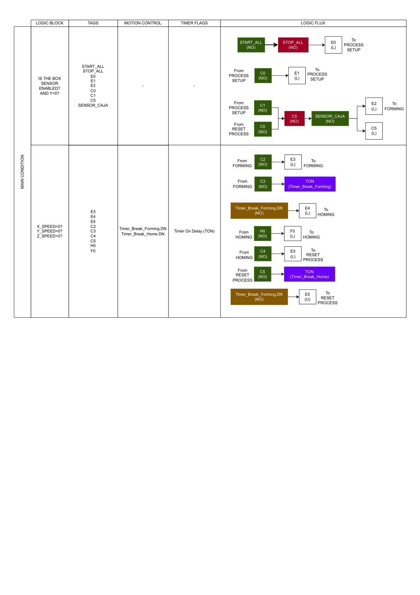
</div>

### Subrutina A - Process Setup
Encargada de preparar el sistema para arrancar:

- secuencias de reset / restart de drivers;
- home de ejes;
- activación del conveyor;
- confirmación de sistema listo.

<div align="center">
  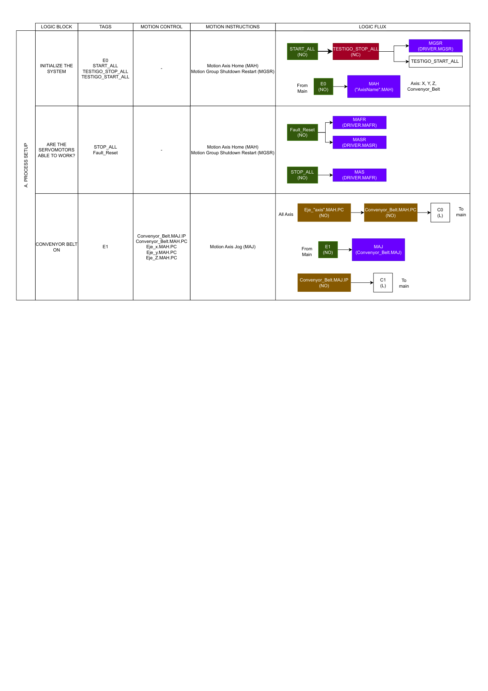
</div>

### Subrutina B - Forming
Ejecuta el movimiento coordinado de formado:

1. se mueven **Y y Z**;
2. al completarse el avance de Z, se habilita **X**;
3. al finalizar el formado se activan confirmaciones para pasar a la siguiente fase.

<div align="center">
  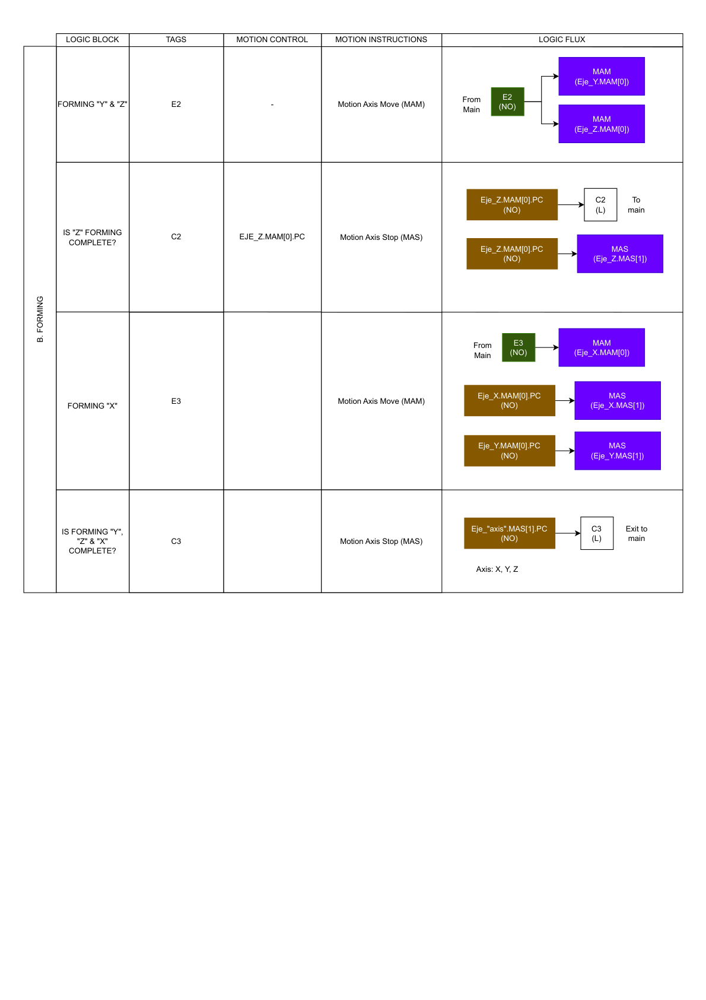
</div>

### Subrutina C - Homing
Retorna los ejes a la posición inicial con una secuencia segura:

- vuelven primero **Y y Z**,
- cuando Z confirma home, se habilita **X**,
- al final se marca **home completo**.

<div align="center">
  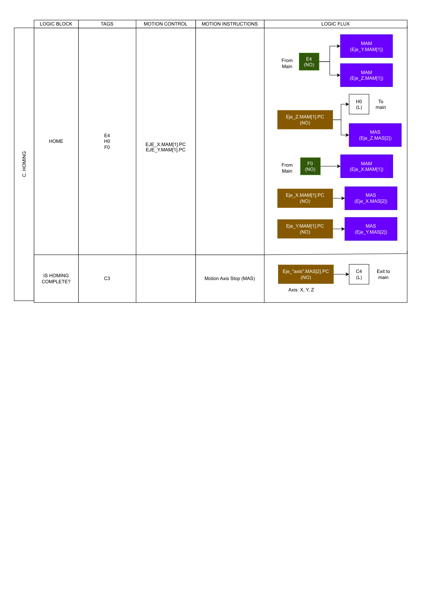
</div>

### Subrutina D - Reset
Limpia el estado interno del ciclo:

- resetea confirmaciones y bits de transición;
- limpia instancias de bloques de movimiento;
- deja el sistema listo para iniciar un nuevo ciclo.

<div align="center">
  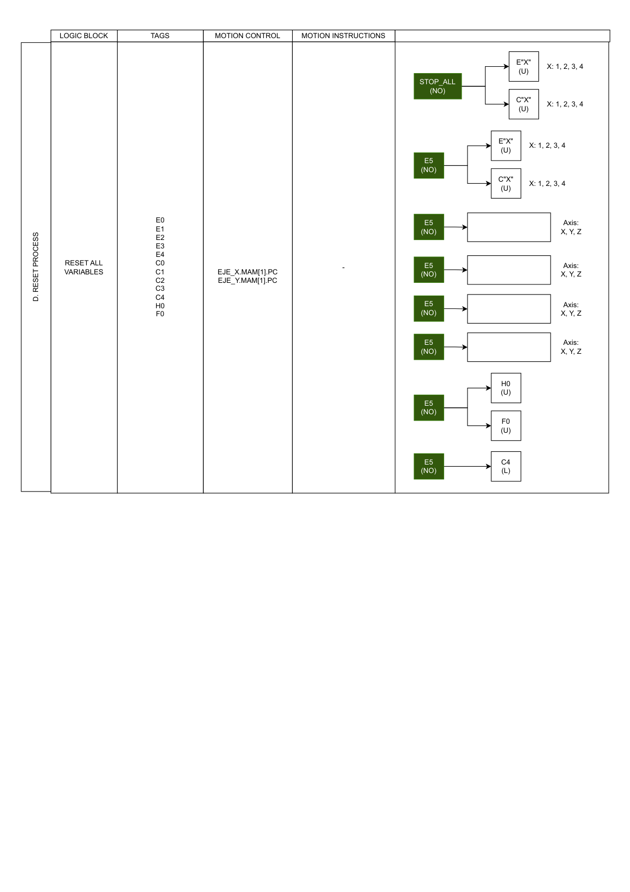
</div>

### Grafcet general

<div align="center">
  
</div>

### Instrucciones de movimiento identificadas

En el material exportado aparecen principalmente:

- **MAM** (`Motion Axis Move`)
- **MAS** (`Motion Axis Stop`)
- **MAJ** (movimiento / jog del conveyor)
- **MAH** (`Motion Axis Home`)
- **MGSR / MASR / MAFR** para gestión de estado del grupo de movimiento y fallas

---

## 🧩 Integración con Siemens NX y OPC DA

Uno de los aportes más interesantes del proyecto es la conexión entre el PLC y el gemelo digital.

### Flujo de integración

1. **Studio 5000** genera señales y estados.
2. **OPC DA** expone variables del proceso.
3. **Siemens NX** consume esas señales para:
   - posicionar ejes,
   - detectar condiciones,
   - generar nuevas cajas,
   - simular agarre / liberación / transporte.
4. Las señales del entorno virtual retroalimentan el ciclo del PLC.

### ¿Qué se valida con el gemelo digital?

- sincronización temporal entre las rutinas;
- correcta secuencia de aparición de cajas;
- coherencia entre movimiento programado y comportamiento visual;
- ausencia de colisiones o desalineaciones evidentes;
- consistencia entre perfiles teóricos y respuesta del sistema.

<div align="center">
  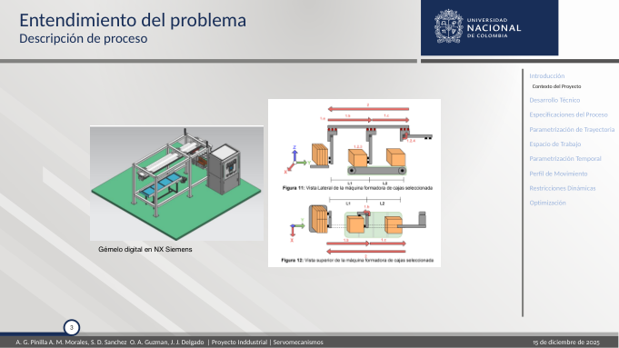
  <p><em>Descripción del proceso y del sistema virtual de referencia.</em></p>
</div>

<div align="center">
  
  <p><em>Panorama de automatización: PLC, Studio 5000, OPC DA, NX y proceso.</em></p>
</div>

<div align="center">
  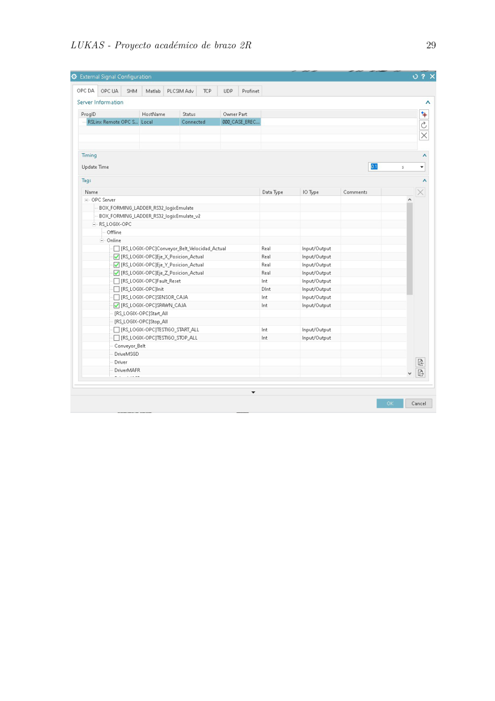
  <p><em>Configuración del servidor OPC y señales externas usadas para la integración.</em></p>
</div>

<div align="center">
  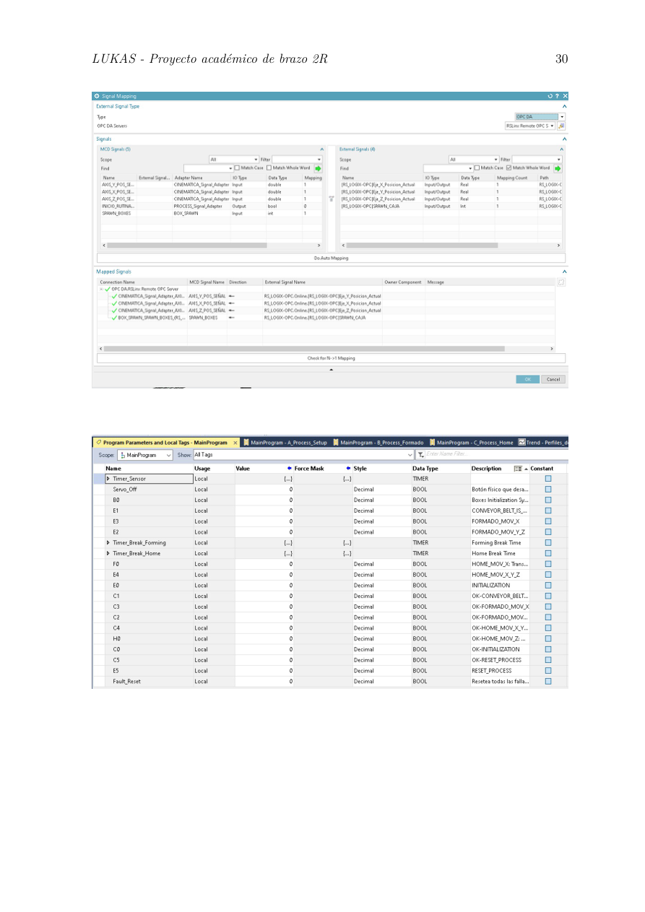
  <p><em>Mapeo de señales entre Studio 5000 y Siemens NX.</em></p>
</div>

<div align="center">
  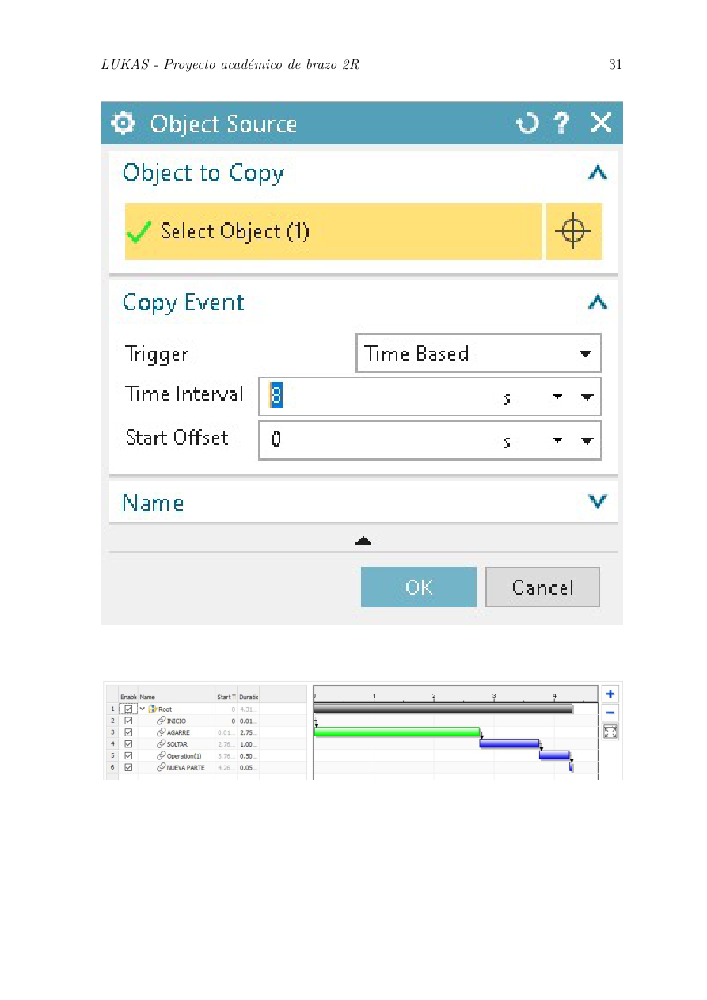
  <p><em>Configuración de eventos temporizados en NX para generación / secuenciación de cajas.</em></p>
</div>

---

## ✅ Validación y Resultados

La validación se apoyó en dos frentes:

- **trends en Studio 5000**, para verificar perfiles de posición, velocidad y aceleración;
- **gemelo digital en Siemens NX**, para revisar el comportamiento físico esperado.

### Hallazgos reportados

- alta correspondencia entre perfiles teóricos y perfiles observados;
- pequeñas diferencias atribuibles a reposos y timers de integración;
- secuencia robusta, coordinada y repetible;
- ciclo práctico de **8 s por caja**, con **7.5 s** de movimiento programado y alrededor de **0.5 s** de sincronización adicional con NX.

<div align="center">
  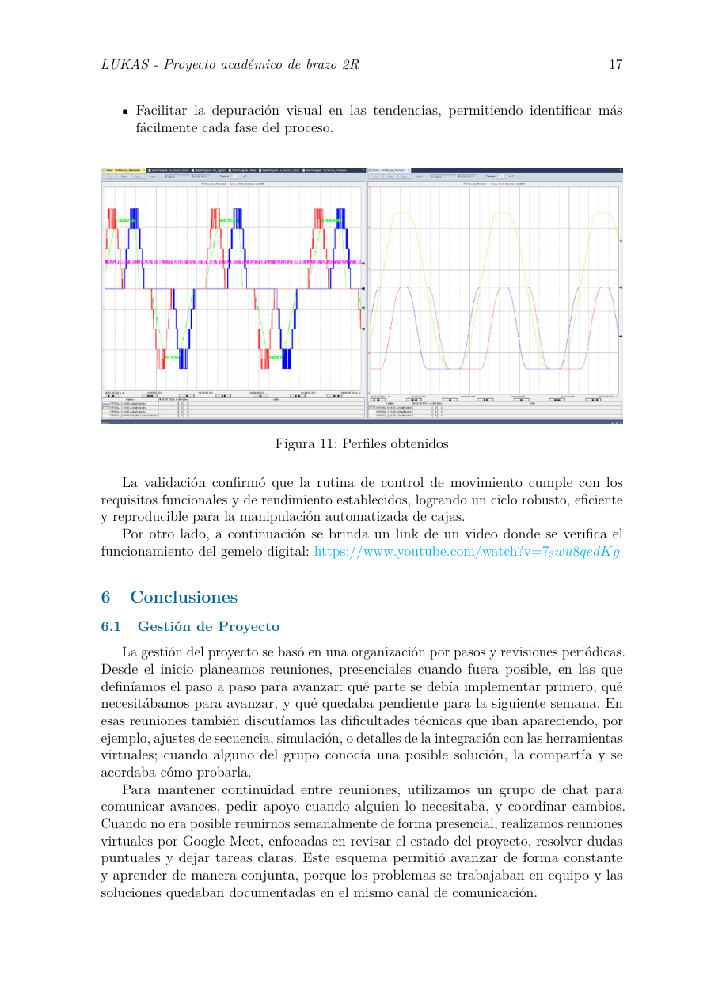
  <p><em>Tendencias usadas para validar la rutina completa frente a los perfiles diseñados.</em></p>
</div>

---

## 📁 Estructura del Repositorio

```text
├── .gitignore
├── LICENSE.md
├── NOTICE.md
├── assets
│   └── img
│       ├── grafcet_overview.png
│       ├── ladder_forming_b.png
│       ├── ladder_homing_c.png
│       ├── ladder_main.png
│       ├── ladder_process_setup_a.png
│       ├── ladder_reset_d.png
│       ├── matlab_metrics.png
│       ├── matlab_profiles.png
│       ├── nx_automation_overview.png
│       ├── nx_motion_profiles_slide.png
│       ├── nx_problem_understanding.png
│       ├── nx_spawn_sequence.png
│       ├── opc_configuration.png
│       ├── opc_signal_mapping.png
│       ├── presentation_cover.png
│       ├── report_cover.png
│       └── studio5000_trends.png
├── cad
│   ├── BOX_FORMING_DIGITAL_TWIN - NX-12_v0.5
│   │   ├── [muchos archivos .prt del gemelo digital]
│   │   ├── cardbox v5.step
│   │   └── cardbox v5.log
│   ├── README.md
│   └── cardbox v5.step
├── docs
│   ├── 00_course_guides
│   │   ├── 25-2S Guia Pry Ind.pdf
│   │   └── 25-2S Servos Pr Industrial.pdf
│   ├── 01_final_report
│   │   └── Informe___Proyecto_Industrial.pdf
│   ├── 02_ladder_and_grafcet
│   │   ├── Servos_FormingB.pdf
│   │   ├── Servos_Grafset.pdf
│   │   ├── Servos_HomingC.pdf
│   │   ├── Servos_Main.pdf
│   │   ├── Servos_ProcessA.pdf
│   │   └── Servos_ResetD.pdf
│   ├── 03_presentation
│   │   └── demo.pdf
│   └── README.md
├── matlab
│   ├── README.md
│   ├── extracted
│   │   ├── optimizar_perfil_8cpm_extracted.m
│   │   ├── perfil_trapezoidal_sliders.m
│   │   └── profile_design_extracted.m
│   ├── original
│   │   ├── OptimizacionValoresAceleracionYREPOSO.mlx
│   │   └── Profile_Design.mlx
│   └── output
│       ├── optimization_output_summary.txt
│       └── profile_design_output_summary.txt
└── plc
    ├── Logic.ACD
    ├── README.md
    └── report_export
        └── Report.pdf
```

---

## 🔑 Archivos Clave

| Archivo / carpeta | Descripción |
|:------------------|:------------|
| `README.md` | Descripción general del proyecto y guía de navegación |
| `docs/01_final_report/Informe___Proyecto_Industrial.pdf` | Informe final del equipo |
| `plc/Logic.ACD` | Proyecto PLC original de Studio 5000 |
| `plc/report_export/Report.pdf` | Exportación completa del controlador y sus rutinas |
| `matlab/original/Profile_Design.mlx` | Diseño base de perfiles trapezoidales |
| `matlab/original/OptimizacionValoresAceleracionYREPOSO.mlx` | Optimización numérica de aceleraciones y reposos |
| `matlab/extracted/perfil_trapezoidal_sliders.m` | Herramienta interactiva de exploración |
| `cad/BOX_FORMING_DIGITAL_TWIN - NX-12_v0.5/` | Gemelo digital completo en Siemens NX |
| `assets/img/` | Imágenes extraídas y renderizadas desde los PDFs del proyecto |

---

## 🎥 Video del Gemelo Digital

Video compartido para evidenciar el funcionamiento del gemelo digital y la integración con Studio 5000:

**https://youtu.be/7_3wu8qedKg**

---

## 🙌 Agradecimientos

A los integrantes del equipo por la documentación y el trabajo colaborativo, y al profesor **Victor Hugo Grisales Palacio** por la orientación académica y por el contexto del gemelo digital utilizado en el curso.

---

## 📄 Licencia

Este repositorio incluye una licencia **académica y de uso educativo no comercial** en `LICENSE.md`.

**Importante:** debido a que el proyecto incluye material académico y activos asociados al gemelo digital del curso, **no** se distribuye bajo una licencia permisiva tipo MIT/Apache. Revise también `NOTICE.md` antes de reutilizar o redistribuir el contenido.

---

<div align="center">
  

  **Proyecto académico de servomecanismos · control de movimiento · Ladder · gemelo digital**
</div>
